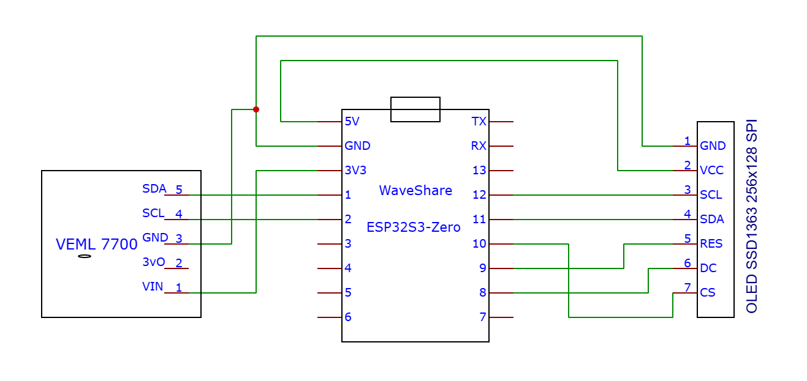

# Philips AJ1000 ESP32-S3 Smart Mirror Dashboard

A complete hardware overhaul of the vintage **Philips AJ1000/12** alarm clock, transforming it into a high-density **ESP32-S3-powered Smart Mirror Home Assistant Dashboard**.

It uses a 2.7" SSD1363 OLED display (256x128 resolution) mounted behind the original one-way mirror front panel, featuring adaptive brightness control, NTP synchronization, custom HA weather graphics, and smooth digit transition animations.

---

## Current State (v0.1.0)

* **Main Clock View:** High-density 92px vertical font for time (`HH:MM`).
* **Header Bar:** Italian date, external temperature (`°C`), and vector weather icons matching Home Assistant MQTT sensors.
* **Smart Dimming:** Hardware VEML7700 light sensor with low-pass hysteresis filtering (~0.8s reaction) for glass penetration.
* **Fluid Digit Transitions:** Day-by-day dynamic animations (Vertical Slide, GlitchShift, 3D Split-Flip, Dust Dissolve, Dithered CrossFade, Wave Scan) with fixed slot positions to prevent screen jitter.
* **OTA**
* **Last Will and Testament MQTT Message**: Useful, especially if you have an uptime checker with Telegram notifications (I use Uptime Kuma on HA).

## Ongoing development (Target: v1.0.0):
* **MQTT Offline Fallback:** Graceful fallback to standalone NTP clock display when Home Assistant is unreachable.
* **HA Interactive Screens:**
  - Detailed Weather forecast screen.
  - "Now Playing" media control view.
  - Home Statistics Gauges (Power consumption, Temp/Humidity, Internet speed...).
  - Mail & Calendar summary.
  - Intercom & Doorbell notifications.
  - DSC Alarm panel status.
  - Alexa requests visual sync.
  - Memos, notes...
* **Navigation:** Physical buttons with water-ripple transition animations (Left/Right swipe).
* **Smart Sleep & Wake Rules:**
  - Auto-sleep after 22:00 if room is dark for > 7 minutes or on button press.
  - Auto-wake on light detection (>2 min), window opened event (HA), or button press.
* **No Distraction Mode:** 5-hour DND triggered by long-pressing both buttons.
* **Android App Control**

---

## Hardware Specs & Components

| Component | Model / Specs |
| :--- | :--- |
| **Enclosure** | Stock Philips AJ1000/12 Shell |
| **Microcontroller** | ESP32-S3-Zero |
| **Display** | 2.7" SSD1363 OLED (256x128, 7-pin SPI) |
| **Light Sensor** | VEML7700 (I2C) |

---

## Wiring Diagram

> **Note:** Initial prototype scheme (button pins omitted in v0.1.0).

---

## Installation & Build

1. Open `AJ1000-SmartMirror-Dashboard.ino` in Arduino IDE.
2. Install dependencies via Library Manager:
   * `U8g2` by Oliver Kraus
   * `Adafruit_VEML7700`
   * `PubSubClient` by Nick O'Leary
3. Follow the instructions present in the .ino to edit the placeholders.
4. Upload onto the board
