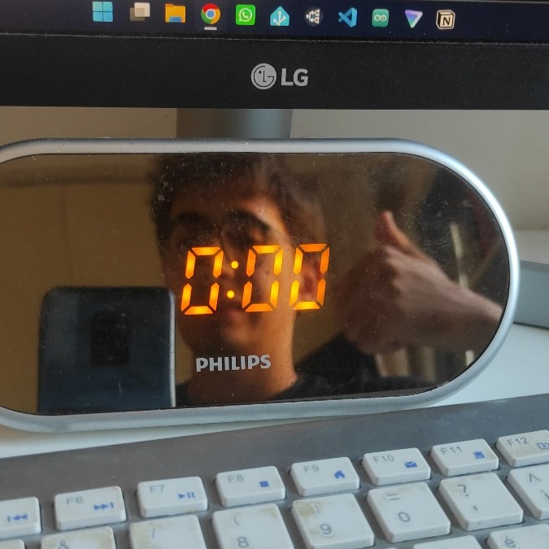
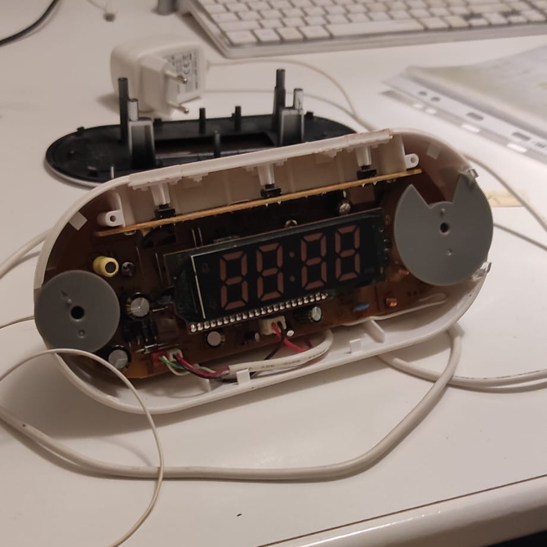
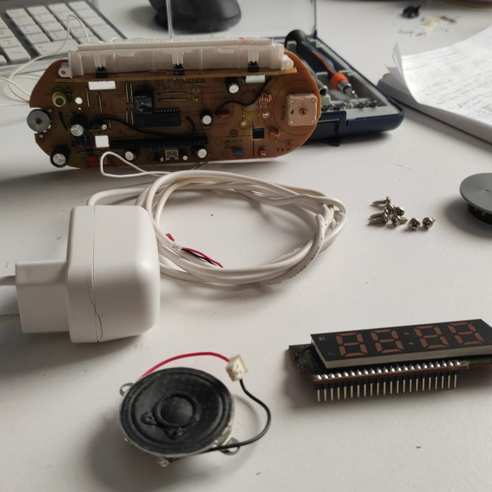
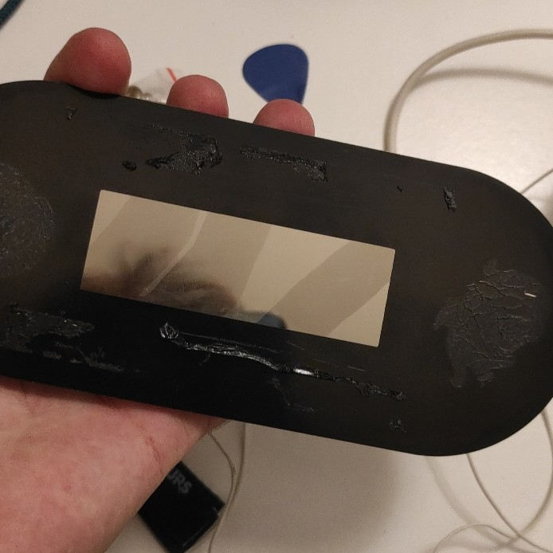
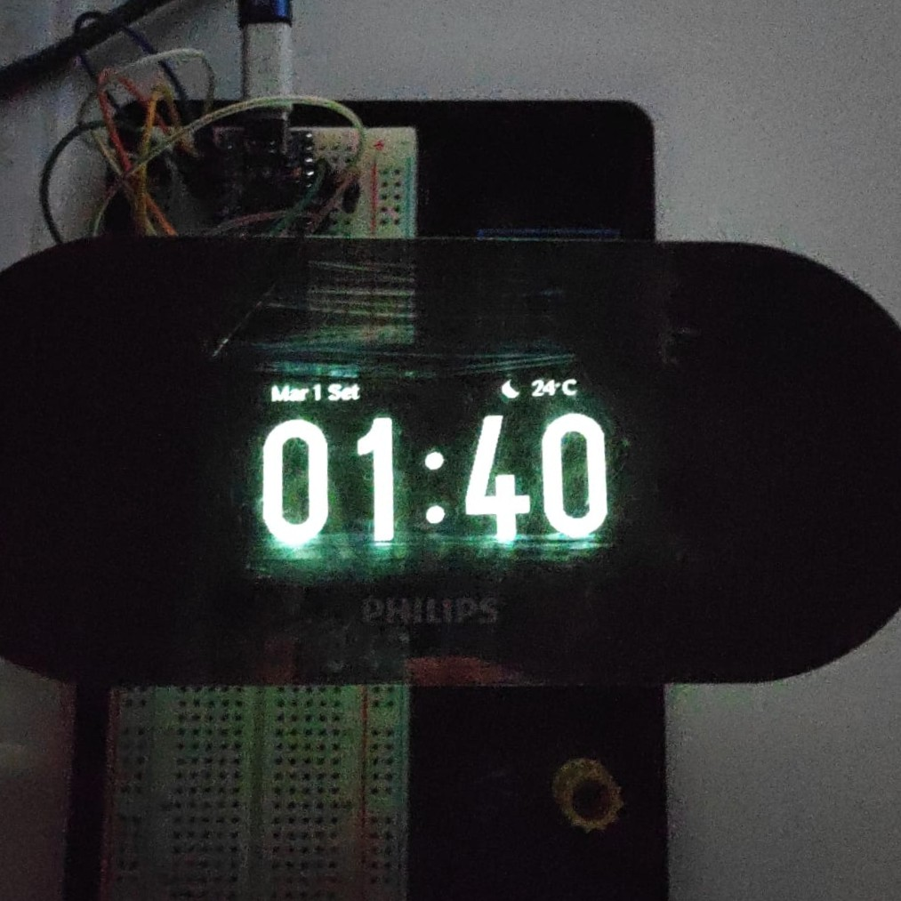
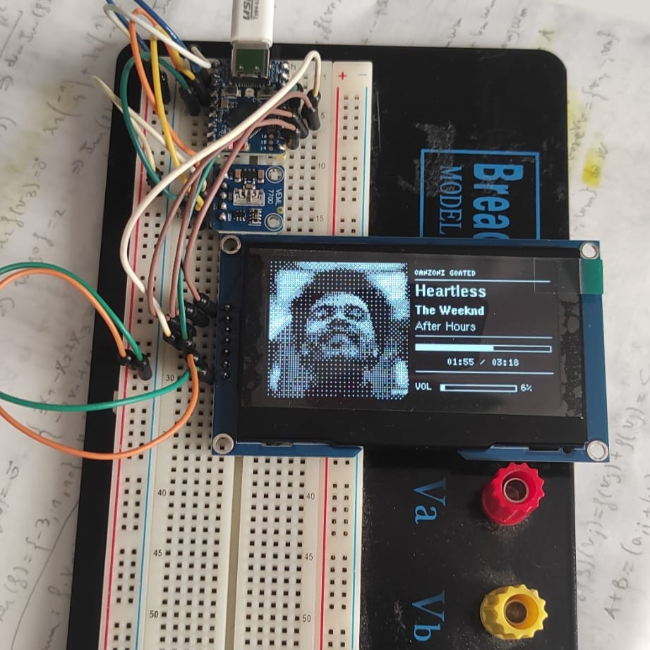

# Philips AJ1000 ESP32-S3 Smart Mirror Dashboard

A complete hardware overhaul of the vintage **Philips AJ1000/12** alarm clock, transforming it into a high-density **ESP32-S3-powered Smart Mirror Home Assistant Dashboard**.

It uses a 2.7" SSD1363 OLED display (256x128 resolution) mounted behind the original one-way mirror front panel, featuring adaptive brightness control, NTP synchronization, custom HA weather graphics, and smooth digit transition animations.

---

## Current State (v0.2.0)

* **Main Clock View:** High-density 92px vertical font for time display (`HH:MM`).
* **Header Bar:** Italian date format, external temperature (`°C`), and vector weather icons matching Home Assistant MQTT sensors.
* **Smart Dimming:** Hardware VEML7700 light sensor with low-pass hysteresis filtering (~0.8s reaction) for optical glass penetration.
* **Fluid Digit Transitions:** Day-by-day dynamic animations (Vertical Slide, GlitchShift, 3D Split-Flip, Dust Dissolve, Dithered CrossFade, Wave Scan) with fixed slot positions to prevent screen jitter.
* **Boot Animations:** Custom startup animations (CRT Expand, Matrix Lock, Sequential Drop).
* **HA Interactive Screens:** * "Now Playing" media dashboard with album cover, track title, artist, album name, playlist, volume level, and a dynamic progress bar with timestamps.
* **MQTT LWT (Last Will and Testament):** Publishes availability status for network uptime monitoring (e.g., Uptime Kuma integration).
* **OTA Updates:** Over-the-air firmware flashing support.
* **Robust Fallbacks:** Graceful standalone UI handling during Wi-Fi drops, MQTT disconnections, or sensor read timeouts.

## Ongoing Development (Target: v1.0.0)

* **HA Interactive Screens:**
  * Detailed Weather forecast view.
  * Home Statistics Gauges (Power consumption, Temp/Humidity, Internet speed).
  * Mail & Calendar summary.
  * Intercom & Doorbell live notifications.
  * DSC Alarm panel integration.
  * Visual synchronization for Alexa requests.
  * Memos and quick notes.
* **Navigation:** Physical buttons with water-ripple transition animations (Left/Right swipe).
* **Smart Sleep & Wake Rules:**
  * Auto-sleep after 10:00 PM if the room remains dark for > 7 minutes, or via button press.
  * Auto-wake upon light detection (>2 min), window sensor event (HA), or button press.
* **No Distraction Mode:** 5-hour Do-Not-Disturb (DND) mode triggered by long-pressing both buttons.
* **Android App Control:** Mobile remote management via a dedicated app.

---

## Project Gallery

  
  
  
  
  
  
  

<em>From left to right: Stock device, opening the shell, internal teardown, mirror glass testing, breadboard prototyping, 'Now Playing' dashboard, and digit transition animation example.</em>

---

## Hardware Specs & Components

| Component | Model / Specs |
| :--- | :--- |
| **Enclosure** | Stock Philips AJ1000/12 Shell |
| **Microcontroller** | ESP32-S3-Zero |
| [**Display**](https://it.aliexpress.com/item/1005006783438037.html) | 2.7" SSD1363 OLED (256x128, 7-pin SPI) |
| **Light Sensor** | VEML7700 (I2C) |

---

## Wiring Diagram

> **Note:** Initial prototype schematic.

---

## Installation & Build

1. Open `AJ1000-SmartMirror-Dashboard.ino` in Arduino IDE.
2. Install dependencies via Library Manager:
   * `U8g2` by Oliver Kraus
   * `Adafruit_VEML7700`
   * `PubSubClient` by Nick O'Leary
3. Follow the instructions present in the .ino to edit the placeholders.
4. Select your **ESP32-S3** board target and upload the sketch.
